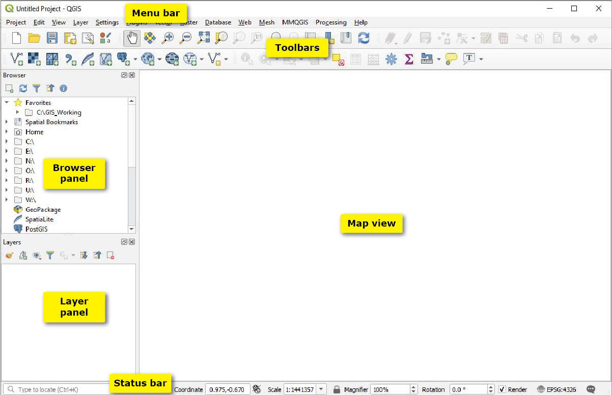
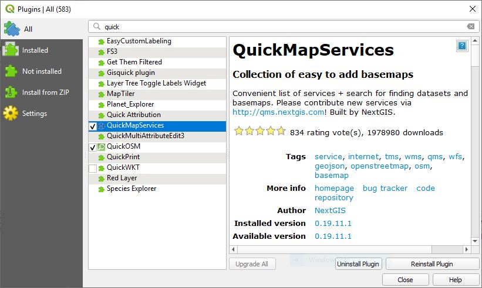

# Getting Started
{: .no_toc }

This page will take you through the steps to install QGIS and become familiar with the interface.
{: .fs-6 .fw-300 }

The photos and instructions were put together on a Windows machine using QGIS 3.10.3, so if you install a different version (or are a Mac or Linux user) the specific instructions and menu names might be different.
{: .note}

  

    Table of contents
  

  {: .text-delta }
1. TOC
{:toc}

---
## Install QGIS
{:toc}

QGIS is a free and open-source software that runs on Mac, Windows, and Linux operating systems. In order to complete the tuturial part of this workshop, you will need to download the software and install it on your personal computer.

[Download QGIS](https://www.qgis.org/){: .btn .btn-purple }

**Everyone**: The recommended version is the long-term release (LTR), currently 3.16. 
**Windows users**: Select one of the install options under the heading "Standalone installers from OSGeo4W packages."

---
## Explore the QGIS interface
{:toc}

Once QGIS installs, launch the program. In the menu bar, click `Project > New` to start a new session. The program should look like the interface below. If additional panels are open, you can close them by clicking the X in the upper right corner.

### Recommended panels
{: .no_toc }

You can turn on/off different panels by clicking `View > Panels`, or by right-clicking in the gray toolbar area. Make sure these two panels are checked on:

* Browser panel
* Layers panel

### Recommended toolbars
{: .no_toc }

The toolbars are the fun part of QGIS, giving you quick access to lots of tools that the program offers. You can turn on/off different toolbars by clicking `View > Toolbars`, or by right-clicking in the gray toolbar area. These are the recommended essential toolbars to turn on:

* Attributes toolbar
* Manage Layers toolbar
* Map Navigation toolbar
* Project toolbar

---
## Install helpful plugins
{:toc}

On its own, QGIS is a fairly bare-bones program that can do basic GIS-y things, but certainly not all the things that proprietary software can do. Plugins extend the functionality of QGIS. Plugins are free and open-source, just like QGIS!

In the menu bar, click `Plugins > Manage and Install Plugins...` Type the plugin name (or a keyword) into the search bar, highlight the plugin, and click `Install Plugin`.

### Recommended plugins
{: .no_toc }

These two plugins are super helpful:
* QuickMapServices
* QuickOSM

**QuickMapServices** allows you to access free base imagery from dozens of providers. After installation, click `Web > QuickMapServices > Settings`, clickon the `Visibility` tab, then make sure all the sources are checked on. They should now appear in the QuickMapServices menu for you to use as base imagery.

**QuickOSM** allows you to search and download free vector data from OpenStreetMap. Launch this plugin by clicking `Vector > QuickOSM > QuickOSM...` An easy way to use this plugin is to navigate the map to your area of interest, then change the query area from "In" to "Canvas Extent." The tool will download all the OSM data in your area of interest!

---
## Open a layer
{:toc}

Let's assume you have a geospatial data layer downloaded onto your hard drive.

There are several ways to open a layer in QGIS:
1. In a system folder window (Windows Explorer or Mac Finder), navigate to the data, then drag and drop it into the QGIS Map View. For shapefiles, you'll have to grab the file that ends with .shp!
1. In the Browser Panel, navigate to the layer, then drag and drop it into the Map View.
1. For vectors: click `Layer > Add Layer > Add Vector Layer...` or click the `Add Vector Layer...` button. In the window that opens, to the right of the `Vector Dataset(s)` box, click the three buttons `...` to open the file explorer. Navigate to the file, click `Open`, then `Add`.
1. For rasters: click `Layer > Add Layer > Add Raster Layer...` or click the `Add Raster Layer...` button. Follow the steps above.

---
## Get more help
{:toc}

That's it for the basics! The QGIS user community maintains a [helpful collection of resources](https://docs.qgis.org/latest/en/docs/index.html) that is worth checking out for more guidance:
* QGIS Desktop User Guide/Manual
* Training Manual
* A Gentle Introduction to GIS
