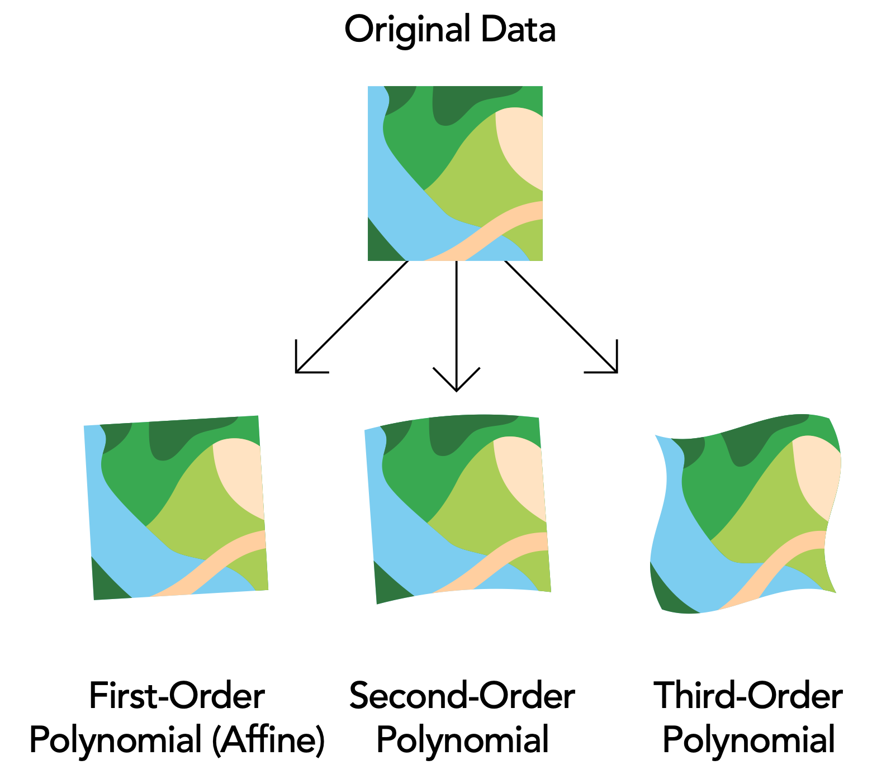
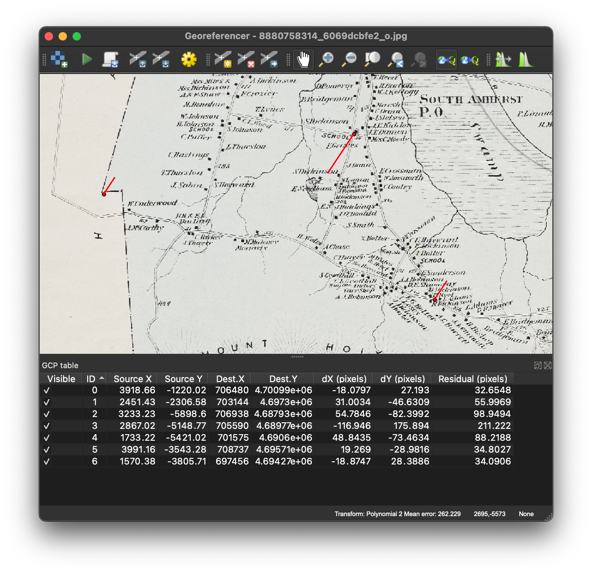
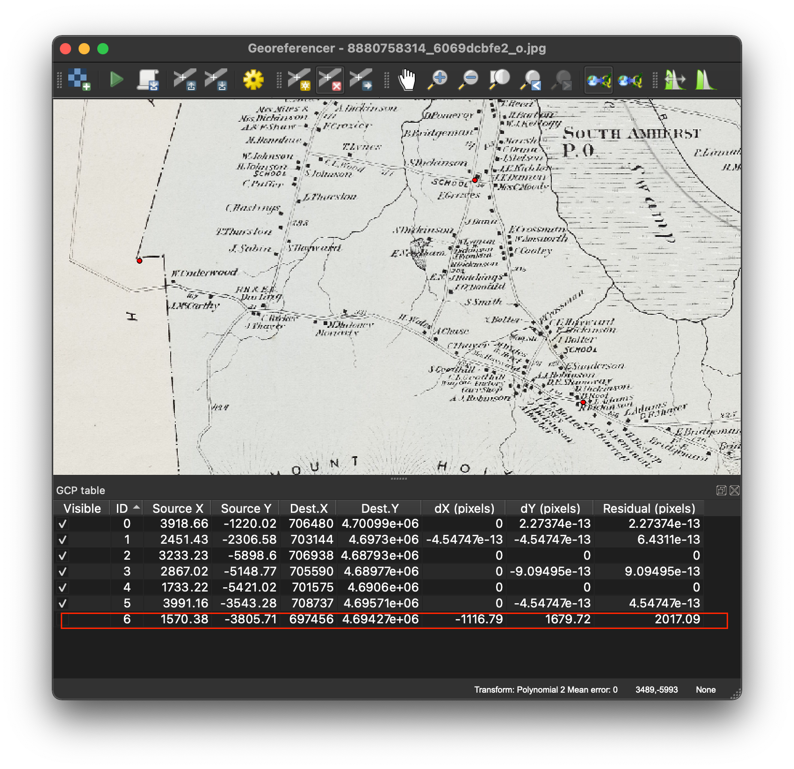

# Advanced Georeferencing
{: .no_toc }

Advanced concepts that are helpful before tackling georeferencing in desktop GIS software
{: .fs-6 .fw-300 }

  

    Table of contents
  

  {: .text-delta }
1. TOC
{:toc}

---
## Overview
{:toc}

If you were comfortable using an online tool to georeference an image and are ready for a challenge, desktop-GIS-based georeferencing is for you!

The concepts in this section are critical to understand before tackling this procedure in desktop GIS software. The reason is that online tools do a lot of behind-the-scenes work for you - they ensure that the source and target layers have the same coordinate systems, and they figure out what transformation and resampling methods to apply. When you georference an image in desktop software, **you** are in charge of making these decisions.

---
## Coordinate systems
{:toc}

Coordinate systems (also known as **Coordinate Reference Systems**, or CRS's) are the most important concept to learn before working with geospatial data in desktop software. CRS's are like languages - if you tell the computer what language a dataset is speaking, it will be able to interpret it and display its location in the correct place. If the computer doesn't know what language the dataset is speaking (or - gasp! - if the language is incorrect), it won't be able to display the location correctly.

Read through this unit on [Coordinate Systems](https://umass-gis.github.io/workshops/content/basics-qgis/coordinate-systems.html) and try the accompanying activities in QGIS. Once you are comfortable identifying a layer's CRS and changing the project CRS, come back here to learn more about georeferencing.

---
## Transformation methods
{:toc}

**Transformation** is the next step in the georeferencing workflow after a set of Ground Control Points (GCPs) are added. The computer uses the GCPs to calculate coordinate locations for every single pixel in the source image.

The transformation process is necessarily complex because of the distortion that exists in every 2D representation (whether map or photo) of a 3D landscape. Hand-drawn maps may not be 100% accurate or to scale, meaning that the computer will need to stretch parts of the map to align with the "real" boundaries of the mapped area. Aerial photos are often taken at a slight angle, which distorts the relationship between objects at different elevations. Even satellite images contain distortion because of the this - mountains and plains may appear closer or further together than they are in real life. Transformation is a necessary step to correct for these issues.

These are the transformation types that are available in QGIS - other software (like ArcGIS Pro) will have similar options but may use slightly different names for them.

| Transformation type | Minimum # of GCPs | What it does |
| :--- | :--- | :--- |
| Helmert | 2 | Shift, scale, rotate |
| Polynomial 1 | 3 | Shift, scale, rotate |
| Polynomial 2 | 6 | Shift, scale, rotate, warp |
| Polynomial 3 | 10 | Shift, scale, rotate, warp more |
| Thin plate spline | Lots | Rubber-sheeting - GCP accuracy is guaranteed, but pixels far away not so much |
| Projective | 4 | Warps lines so they remain straight, good for oblique images |

This graphic shows what happens to your source layer when different polynomial transformation types are used:

<figcaption>Polynomial transformation types ([Esri 2018: Understanding Raster Georeferencing](https://www.esri.com/about/newsroom/wp-content/uploads/2018/07/Understanding-Raster-Georeferencing.pdf))</figcaption>

### Which transformation method should I use?

The *Second-Order Polynomial* (or Polynomial 2) is a good choice for most maps and aerial photos.

---
## Residual error
{:toc}

As you add GCPs to the georeferencing session, the software constantly tries to readjust the image so that it has the best possible match with target layer. How the software determines this "best fit" depends on the transformation method and the quality of the GCPs.

For most methods, the GCPs will have some **residual error**. This value is the distance (in pixels) from where you placed the GCP to where the software wants to put it.

These examples show a map in the process of being georeferenced. The GCPs I placed all have high residual errors, which are reported in the table at the bottom. You can also see that the georeferencing isn't quite right, because there are relatively long red lines (where the computer wants to move the GCPs to) extending from the red dots (where I placed the GCPs).

<figcaption>Sample GCPs with high residual error</figcaption>

In this situation, the high residual error was caused by a single misplaced GCP. When I remove the errant GCP, the total mean error drops and the GCPs are no longer being moved great distances.

<figcaption>Same session with problematic GCP turned off</figcaption>

Low residual error does not necessarily mean the registration is accurate. Likewise, a high residual error does not necessarily mean a GCP is incorrectly positioned. If in doubt, double-check your GCPs!
{: .note}

---
## Resampling methods
{:toc}

**Resampling** is the final step in the georeferencing workflow. It creates a new version of the image you just georeferenced, together with its coordinate information embedded inside it.

Like transformation, resampling is essentially a mathematical problem that the computer needs to solve, and there are a few different ways you can ask the computer to solve it. These are the most common techniques:

| Resampling type | What it does | When to use it |
| :--- | :--- | :--- |
| Nearest Neighbor | Adopts the value of the nearest pixel, does not alter input values | Categorical data (land use) |
| Linear | Calculates a new value based on the 4 nearest pixels; provides a smoother image | Continuous data (elevation, rainfall)|
| Cubic | Calculates a new value based on the 16 nearest pixels; provides a sharper image | Imagery (aerial photos, satellite)|

### Which resampling method should I use?
If you are resampling data that has categories (like land use types), you must use Nearest Neighbor.

If you are working with continuous data, you can use any of the methods. Those near the top of the table will produce "blockier" images, but they will be quicker to run and less computationally intensive. You might try experimenting with each method and assessing which result you are most happy with.

### What file type should I use?
I recommend saving the output file in `.tif` format (a georeferenced image in this format is called a GeoTIFF file). Other common formats are `.jpg` and `.img`.

---
## Learn more
{:toc}

To read more about identifying GCPs, transformation methods, root mean square error, and resampling methods, check out Esri's [Fundamentals of georeferencing a raster dataset](https://desktop.arcgis.com/en/arcmap/latest/manage-data/raster-and-images/fundamentals-for-georeferencing-a-raster-dataset.htm).
