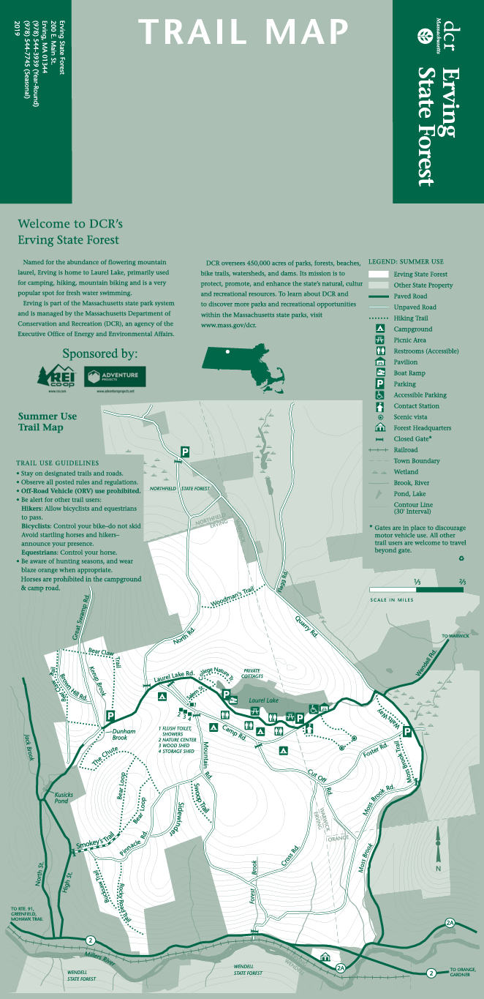

# Exercise
{: .no_toc }

Practice designing a static map in QGIS
{: .fs-6 .fw-300 }

This tutorial was put together on a Mac using QGIS 3.22.4-Białowieża, so if you install a different version (or are a Windows user) things might look a little different.
{: .note}

  

    Table of contents
  

  {: .text-delta }
1. TOC
{:toc}

---

## Overview

In this exercise, I'll create a map following the [How to Design Your Own Map](./map-design.html#how-to-design-your-own-map) guide. You can watch the workshop recording if you would like to follow along with the demo.

### Resources to check out
{: .no_toc }

* Ujaval Gandhi's [Making a Map (QGIS3)](https://www.qgistutorials.com/en/docs/3/making_a_map.html) is an excellent step-by-step tutorial that you can follow along using the data from this workshop.
* The QGIS Training Manual's module on [Laying out the Maps](https://docs.qgis.org/3.28/en/docs/training_manual/map_composer/index.html) has a series of follow-along exercises showing how to create a map.

---
## Decide what you want to map

Imagine you are organizing a hike in your favorite spot, Erving State Forest. The forest is run by the MA Department of Conservation and Recreation (DCR), who make very lovely trail maps. The official DCR trail map for Erving State Forest is available [online](https://www.mass.gov/locations/erving-state-forest).

There are some things about this map that you’d like to change to make it easier for you and your companions to navigate the intricate trail system in the park.

You want to:
* Zoom in to one section of the forest
* Add more detailed topographic contour lines
* Use color to highlight the specific trails you’ll be hiking
* Use custom symbols to mark points of interest

### Step 1. Determine the scope and focus of the map
{: .no_toc }

 
**Q: What kind of information will the map show?**
 You'll need the official DCR trails and points of interest, elevation contours, major roads, the boundaries of the state forest, and an outline of Massachusetts to show where the park is located.

**Q: Who is your intended audience?**
 Your hiking companions - this isn't an official map, just something fun.

**Q: How will the map be shared - as an image, PDF, printout, etc.?**
 You'll print out copies of the map so that your hiking buddies can reference them without needing to use their cell phones. You should save the map as a PDF so you can print it.

**Q: What scale is appropriate for this topic?**
 The map should be zoomed in to the specific trails you'll be following. The official DCR map is at a smaller scale (i.e. it's more zoomed out) than you'd like.

### Step 2: Get the Data
{: .no_toc }

Now that you know what you want to map, you'll need to find the data. Since the map I'm creating is about park and trails managed by the Massachusetts Department of Conservation and Recreation, it makes sense to look for the data on the state's GIS portal, [MassGIS](https://www.mass.gov/orgs/massgis-bureau-of-geographic-information).

These are the MassGIS layers I'll be working with:

* [DCR trails and points of interest](https://www.mass.gov/info-details/massgis-data-department-of-conservation-and-recreation-roads-trails)
* [Elevation contours (1:5,000)](https://www.mass.gov/info-details/massgis-data-elevation-contours-15000)
* [Major roads](https://www.mass.gov/info-details/massgis-data-massachusetts-department-of-transportation-massdot-roads)
* [Boundaries of the state forest](https://www.mass.gov/info-details/massgis-data-protected-and-recreational-openspace)

Additionally, I want a generalized outline of Massachusetts to show where the park is located. For this, I'll use Natural Earth's large-scale (1:10m) cultural data, admin level 1 (states and provinces):

* [Outline of Massachusetts](https://www.naturalearthdata.com/downloads/10m-cultural-vectors/)

Feel free to use your own data, or follow along by downloading the data pack I'm using.

[Get the trail map data pack](https://github.com/umass-gis/workshops/blob/main/content/static-map/data/trailmap_datapack_mar2023.zip){: .btn .btn-primary}

This link will take you to a page on GitHub. Click the `download` button to save it to your computer.

---
## Style the data in the map viewer

### Step 3: Decide on color and symbology
{: .no_toc }

### Step 4: Decide on fonts and use labels to highlight important features
{: .no_toc }

---
## Compose the map in Print Layout

### Step 5: Add the map frame
{: .no_toc }

### Step 6:  Include important map elements
{: .no_toc }

Title
Scale   
Direction       
Legend             
Data sources    
Locator or inset maps

---
## Assess and revise

### Step 7: Honestly assess your map
{: .no_toc }

Ask yourself these questions:
* Is it easy to identify important information?
* Is the layout balanced?
* Does the map take into account optical center and natural eye movement?
* Is it accessible?
* Does it abide by the Cartography Code of Ethics?

If you answer "no" or even "I'm not sure" to any of these questions, think of how you might make changes to improve the map. If in doubt, ask a friend or colleague to take a look and share their feedback.

### Step 8: Export the map
{: .no_toc }

### Step 9: Revel in your new map
{: .no_toc }

Congratulations! Click the URL on the GitHub Pages site and check out your web map!
