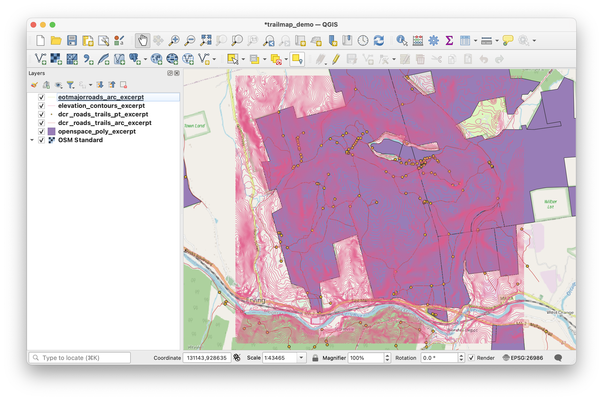
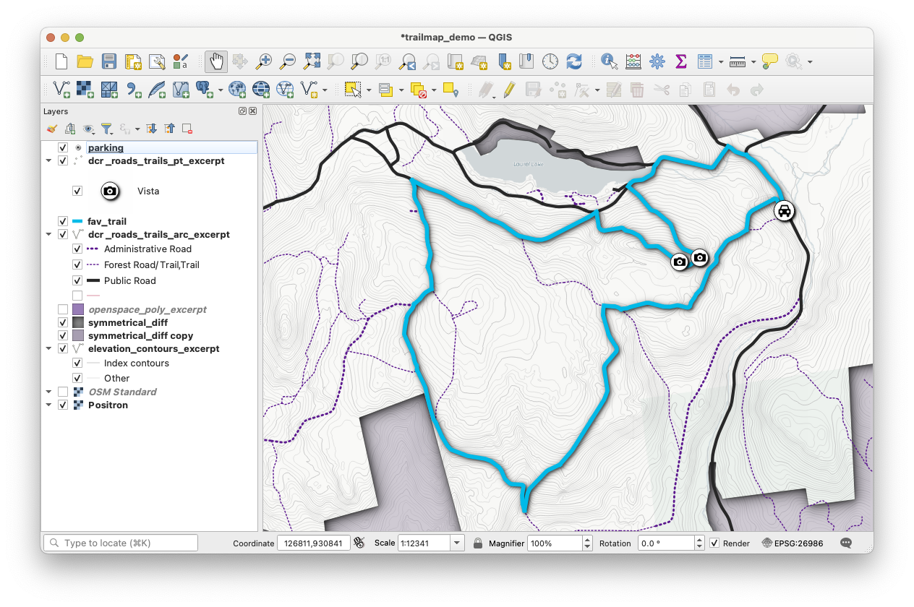
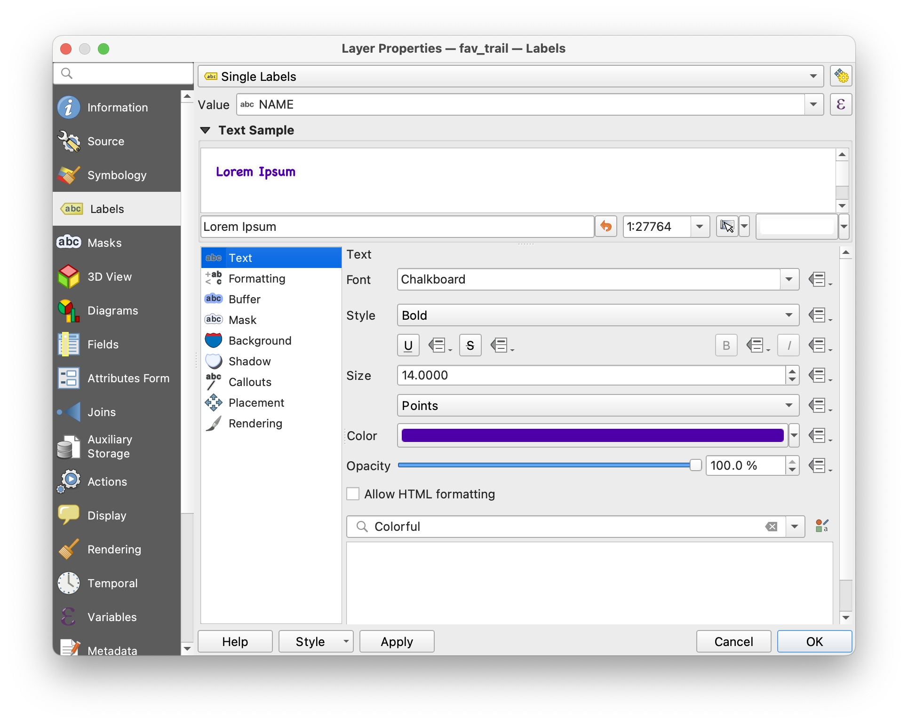
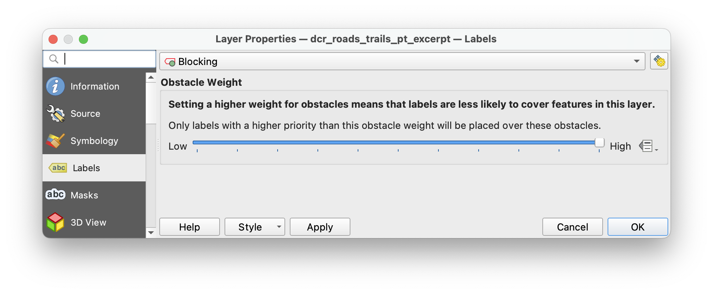
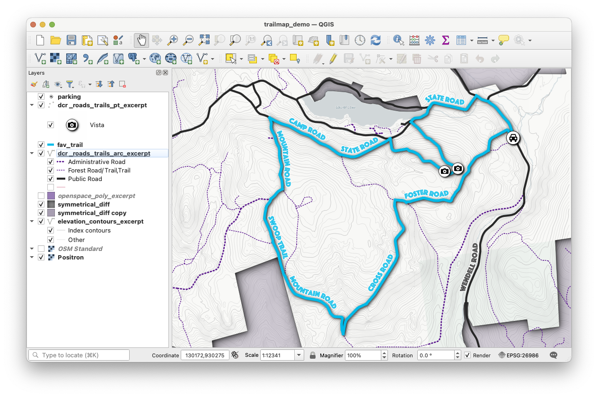
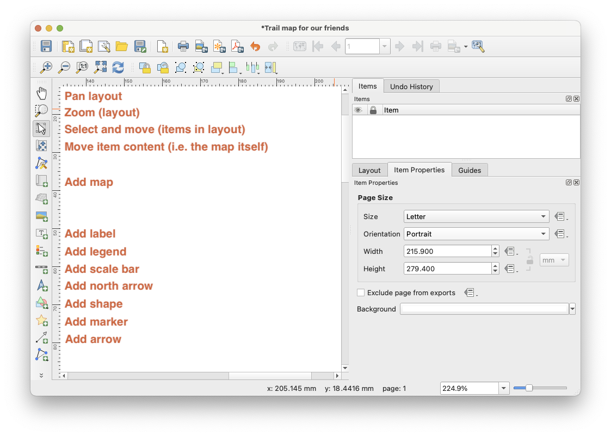
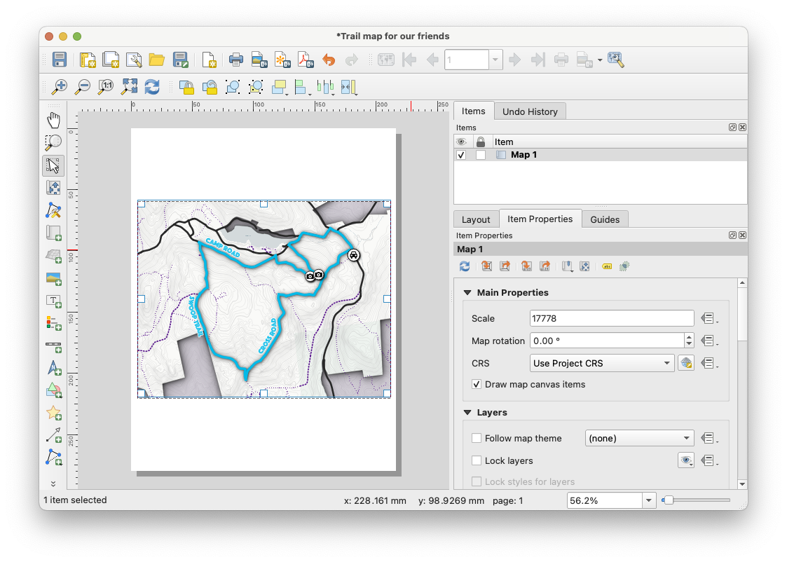
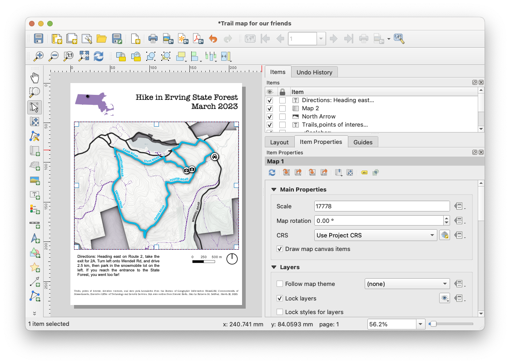

# Exercise
{: .no_toc }

Practice designing a static map in QGIS
{: .fs-6 .fw-300 }

This tutorial was put together on a Mac using QGIS 3.22.4-Białowieża, so if you install a different version (or are a Windows user) things might look a little different.
{: .note}

  

    Table of contents
  

  {: .text-delta }
1. TOC
{:toc}

---

## Overview

In this exercise, I'll create a map following the [How to Design Your Own Map](./map-design.html#how-to-design-your-own-map) guide. You can watch the workshop recording if you would like to follow along with the demo.

### Other resources to check out
{: .no_toc }

* Ujaval Gandhi's [Making a Map (QGIS3)](https://www.qgistutorials.com/en/docs/3/making_a_map.html) is an excellent step-by-step tutorial that you can follow along using the data from this workshop.
* The QGIS Training Manual's module on [Laying out the Maps](https://docs.qgis.org/3.28/en/docs/training_manual/map_composer/index.html) has a series of follow-along exercises showing how to create a map.

---
## Decide what you want to map

Imagine you are organizing a hike in your favorite spot, Erving State Forest. The forest is run by the MA Department of Conservation and Recreation (DCR), who make very lovely trail maps. The official DCR trail map for Erving State Forest is available [online](https://www.mass.gov/locations/erving-state-forest).

### DCR trail map of Erving State Forest
{: .no_toc }

There are some things about this map that you’d like to change to make it easier for you and your companions to navigate the intricate trail system in the park.

You want to:
* Zoom in to one section of the forest
* Add more detailed topographic contour lines
* Use color to highlight the specific trails you’ll be hiking
* Use custom symbols to mark points of interest

### Step 1. Determine the scope and focus of the map
{: .no_toc }

 
**Q: What kind of information will the map show?**
 You'll need the official DCR trails and points of interest, elevation contours, major roads, the boundaries of the state forest, and an outline of Massachusetts to show where the park is located.

**Q: Who is your intended audience?**
 Your hiking companions - this isn't an official map, just something fun.

**Q: How will the map be shared - as an image, PDF, printout, etc.?**
 You'll print out copies of the map so that your hiking buddies can reference them without needing to use their cell phones. You should save the map as a PDF so you can print it.

**Q: What scale is appropriate for this topic?**
 The map should be zoomed in to the specific trails you'll be following. The official DCR map is at a smaller scale (i.e. it's more zoomed out) than you'd like.

### Step 2: Get the Data
{: .no_toc }

Now that you know what you want to map, you'll need to find the data. Since the map I'm creating is about park and trails managed by the Massachusetts Department of Conservation and Recreation, it makes sense to look for the data on the state's GIS portal, [MassGIS](https://www.mass.gov/orgs/massgis-bureau-of-geographic-information). Additional helpful data can be found on [Natural Earth](https://www.naturalearthdata.com/).

[Get the trail map data pack](https://github.com/umass-gis/workshops/blob/main/content/static-map/data/trailmap_datapack_march2023.zip){: .btn .btn-primary}

This link will take you to a page on GitHub. Click the `download` button to save it to your computer.

If you prefer to work with the original (state-wide) datasets, these are the MassGIS layers I used to make the data pack:

* [DCR trails and points of interest](https://www.mass.gov/info-details/massgis-data-department-of-conservation-and-recreation-roads-trails)
* [Elevation contours (1:5,000)](https://www.mass.gov/info-details/massgis-data-elevation-contours-15000)
* [Major roads](https://www.mass.gov/info-details/massgis-data-massachusetts-department-of-transportation-massdot-roads)
* [Boundaries of the state forest](https://www.mass.gov/info-details/massgis-data-protected-and-recreational-openspace)

And this layer is from Natural Earth's large-scale (1:10m) cultural data, admin level 1 (states and provinces):

* [Outline of Massachusetts](https://www.naturalearthdata.com/downloads/10m-cultural-vectors/)

---
## Style the data in the map viewer

### Step 3: Decide on color and symbology
{: .no_toc }

After unzipping and adding the shapefiles to QGIS, the hard part begins! Your task is to use all your hard-earned QGIS skills to change the way the data look to reflect their importance.

**Quick tips:**
* Add a free basemap (I recommend the **QuickMapServices plugin**) to help situate your viewer.
* Open each layers' attribute tables to find out what data they contain. Which of these fields might be useful for styling the way the layer looks?
* Play around with different symbology schemes: single symbol, categorized, graduated, rule-based.
* Use transparency to decrease the visibility of less important layers.
* Use custom SVG markers for your point data to make it more unique (I recommend the **Resource Sharing plugin** and the package called **Mapbox's Maki Icons**)

### Step 4: Decide on fonts and use labels to highlight important features
{: .no_toc }

All facets of labels can be adjusted in the `Labels` menu. These are the submenus I like to experiment with:
* **Text**: where to change the Font, Style, Size, and Color
* **Buffer**: enabling a buffer draws a white (or other color of your choice) blob behind the text, which can help the text stand out from the background
* **Shadow**: sometimes a drop shadow does a better job of helping your text stand out
* **Placement**: use the "Curved" mode for wavy lines, like roads or rivers; you can also change allowed positions and offset from the feature
* **Rendering**: in the section "Feature options", the "Merge connected lines to avoid duplicate labels" is helpful for layers like our trails data that have lots of line segments for each trail

What if your labels overlap another feature in the map? Open the *overlapped feature's label menu* and select "Blocking" from the drop-down menu, then increase the obstacle weight. The higher the weight, the less likely labels from another feature will overlap it.

Ta da! We now have a preliminary map with fun colors, symbology that helps the reader understand some features as more important, and labels for important trails.

---
## Compose the map in Print Layout

### Step 5: Launch Print Layout
{: .no_toc }

Create a new map:
* Open the Layout Manager (Project > Layout Manager)
* Click "Create"
* Enter a name for your new map layout, then click "OK"

You can create as many different layouts as you like in each QGIS project. Return to the Layout Manager anytime you want to open or create a different layout.
{: .note}

Set the page size:
* In the panel on the right, navigate to the "Item Properties" tab
* Change the size to a default option (like "Letter" for the US standard 8.5" x 11") or select "Custom" and set your own measurements.

### Step 6: Add the map frame and important elements
{: .no_toc }

These are the buttons I use most often when creating a map in QGIS:

To add the map frame, click the `Add Map` button and draw a rectangle on the canvas where you want the map frame to go. The map you were working on automatically loads in the frame.

**Quick tips:**
* If you select an element and open the "Item Properties" tab, there are endless things you can change about the item. For maps, this includes the CRS, a grid, a frame outline.
* Checking the option for `Lock layers` prevents any changes you make in QGIS from updating in your map layout. **Use this feature often and wisely**.

As you begin adding the map frame and other elements, remember to position them to maximize optical center and natural eye movement. Elements you might want to add:

* Title
* Scale   
* Direction       
* Legend             
* Data sources    
* Locator or inset maps

---
## Assess and revise

### Step 7: Honestly assess your map
{: .no_toc }

Ask yourself these questions:
* Is it easy to identify important information?
* Is the layout balanced?
* Does the map take into account optical center and natural eye movement?
* Is it accessible?
* Does it abide by the Cartography Code of Ethics?

If you answer "no" or even "I'm not sure" to any of these questions, think of how you might make changes to improve the map. If in doubt, ask a friend or colleague to take a look and share their feedback.

### Step 8: Export the map
{: .no_toc }

In the top menu bar, click one of the buttons for `Export as image`, `Export as SVG`, or `Export as PDF`.

### Step 9: Revel in your new map
{: .no_toc }

Congratulations! Click the URL on the GitHub Pages site and check out your web map!
