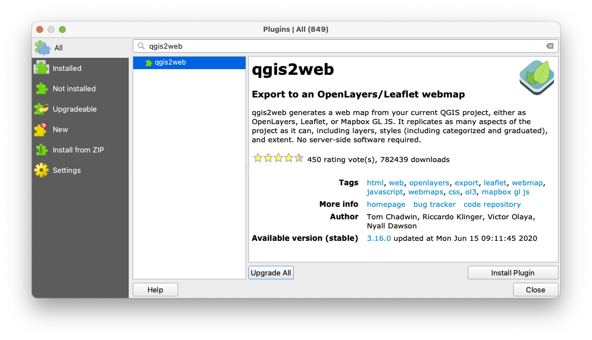
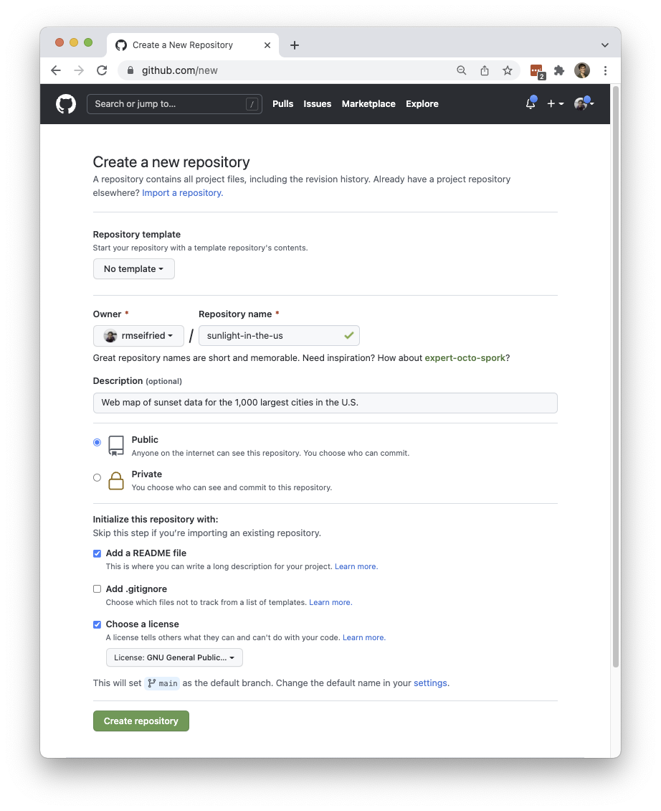
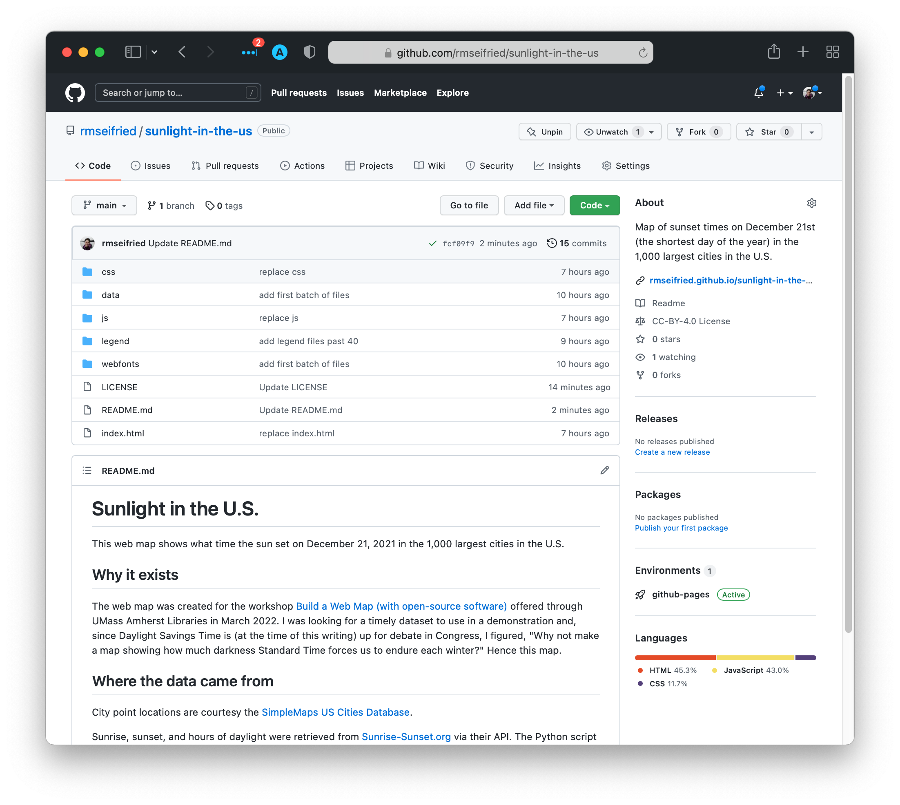
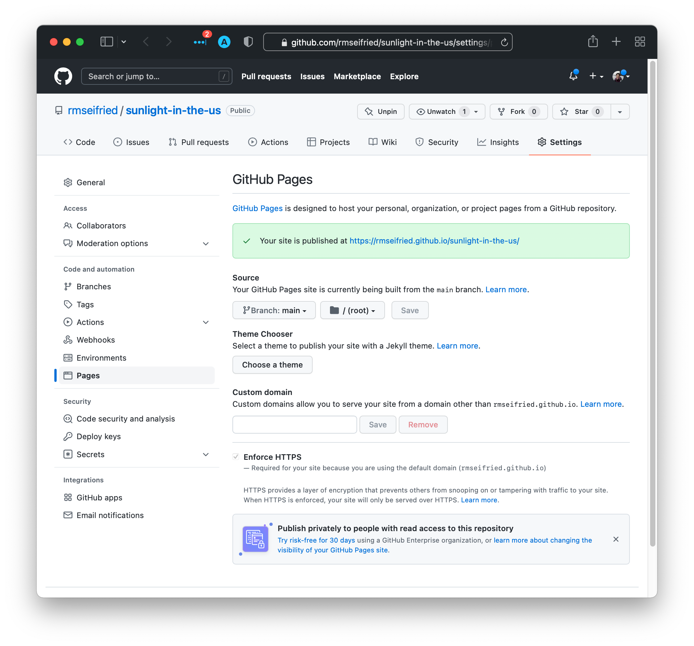

# Exercise
{: .no_toc }

Practice creating a web map in QGIS
{: .fs-6 .fw-300 }

  

    Table of contents
  

  {: .text-delta }
1. TOC
{:toc}

---

## Overview

There are lots of ways to make a web map. This exercise uses a relatively easy method by taking advantage of the  qgis2web plugin that was designed for the open-source software, QGIS. This exercise is *not a complete step-by-step tutorial*. You can watch the workshop recording if you would like to follow along with the demo.

### Resources to check out
{: .no_toc }

* Ujaval Gandhi's [Web Mapping with QGIS2Web (QGIS3)](https://www.qgistutorials.com/en/docs/3/web_mapping_with_qgis2web.html) is an excellent step-by-step tutorial that you can follow along using the data from this workshop.
* Tom Chadwin's [qgis2web GitHub repo](https://github.com/tomchadwin/qgis2web), where you can find more information and details about the qgis2web plugin.
* The suite of tutorials about [Leaflet](https://leafletjs.com) - particularly helpful if you choose the Leaflet export option in qgis2web and want to level-up by adding your own customizations to the code.

---
## Design a map

### Step 1: Get the Data
{: .no_toc }

The first step is to figure out what data you want to include in the map.

For the demo, I'm using a single point layer that has a mix of categorical and quantitative data. Feel free to use your own data, or follow along by downloading the data pack I'm using.

[Get the sunlight data pack](https://github.com/umass-gis/workshops/blob/main/content/web-map/data/sunlight_datapack.zip){: .btn .btn-primary}

This link will take you to a page on GitHub. Click the `download` button to save it to your computer.

### Step 2: Make the Data Look Nice
{: .no_toc }

Once you've got data, use QGIS to design a map that you want to share with the world online. Some things to think about:
* **Colors** - make sure they're accessible and look good on a screen (try [Color Brewer 2.0](https://colorbrewer2.org)!)
* **Fonts** - ditto
* **Field names** - if fields will appear anywhere in your map (e.g. pop-ups), give them a human-readable "alias" in `Layer Properties > Attribute Form`
* **Overall design** - think about how someone will interact with your web map; aim for simple and easy to interpret

Check out the State of Minnesota’s guides for [Interactive Web Maps](https://mn.gov/mnit/about-mnit/accessibility/maps/web.jsp) for help ensuring your web map is accessible.

---
## Create the web map files

### Step 3: Install the qgis2web plugin
{: .no_toc }

See [Installing Helpful Plugins](https://umass-gis.github.io/workshops/content/basics-qgis/getting-started.html#install-helpful-plugins) for instructions if you need a refresher on how to install plugins.

### Step 4: Use the qgis2web plugin
{: .no_toc }

For a step-by-step tutorial, see Ujaval Gandhi's [Web Mapping with QGIS2Web (QGIS3)](https://www.qgistutorials.com/en/docs/3/web_mapping_with_qgis2web.html).

No, seriously. That tutorial is awesome, and has lots of screenshots to help you configure the plugin correctly in order to export (and test out) the web map pack.

---
## Upload the files to GitHub

The rest of the steps in this exercise will guide you through how to upload the files to a GitHub repository and publish the web map with GitHub Pages.

[Check out the demo repository before getting started](https://github.com/rmseifried/sunlight-in-the-us){: .btn .btn-primary}

### Step 5: Sign in to GitHub
{: .no_toc }

Or create a new account if you don't have one yet.

### Step 6: Create a new repository
{: .no_toc }

Click the green `New` button to create a new repository that will host the web map files. Give it a name and description, and configure the rest of the settings.

Once the repo is created and you see the main overview page, click `Add file > Upload files`. Drag-and-drop or upload the files that the qgis2web plugin created (making sure to preserve the folder structure), add a short note in the "Commit Changes" box, then click `Commit Changes`.

If you hit a file upload limit, you might need to upload the files in a couple of batches.
{: .warn}

Make sure to fill out the `ReadMe.md` file so that people who visit your repo will know what it's about, who made it and why, and where the data came from.

## Publish the web map

### Step 7: Use [GitHub Pages](https://pages.github.com) to generate a website from the files
{: .no_toc }

1. Go to `Settings`, then navigate to the `Pages` tab on the left panel.
1. Below "Source", select the `main` branch from the dropbdown menu. Click `Save`.

Your web map should go live in a few minutes. Once it's done, the `Pages` page should look like this:

### Step 8: Revel in the web map
{: .no_toc }

Congratulations! Click the URL on the GitHub Pages site and check out your web map!
