# Zipping and Unzipping Files
{: .no_toc }

Zip files act like folders and may contain one or more compressed files. To access and use the files, the zip file must be “unzipped”. When creating a zip file, multiple files are combined into one .zip file, and the overall file size is reduced. Creating a ZIP file is helpful when you need to:
* Share more than one or two files with someone (over email, OneDrive, Google Drive, etc.)
* Reduce the total size of an email attachment
* Share a shapefile (since a shapefile is actually made up of multiple files)
* Backup a folder to save in OneDrive or Google Drive
{: .fs-5 .fw-300 }

  

    Table of contents
  

  {: .text-delta }
1. TOC
{:toc}

---
## Unzipping Files on Windows
{:toc}

If you want more options when managing ZIP files on Windows, check out the free software [7 Zip.org](https://www.7-zip.org/).

**Video**: [How To Zip/Unzip A File Or Folder In Windows 10](https://www.youtube.com/watch?v=5Wm4PwF8DqY)

#### Method 1 (Windows)
{:toc}

1. To unzip a file, right click the file, opening up the context menu
1. Within the context menu, select **“Extract all”**

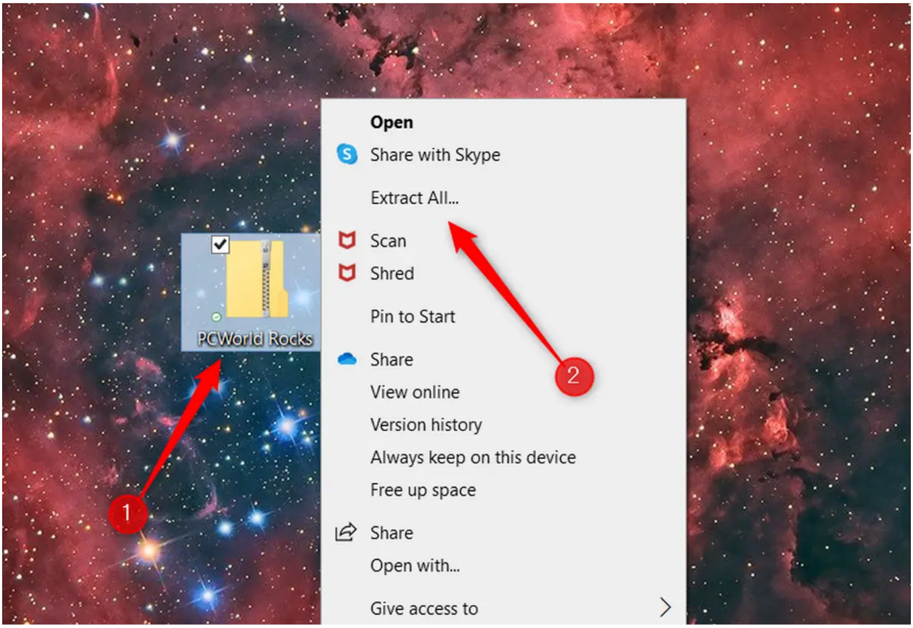
[Image: Marshall Gunnell/IDG](https://www.pcworld.com/article/394871/how-to-unzip-files-in-windows-10.html)

#### Method 2 (Windows)
{:toc}

1. **Double-click** the ZIP file to view its contents and click the “Extract all” button. (Individual files may be extracted by clicking the check box to the left of each file and choosing “extract”.)

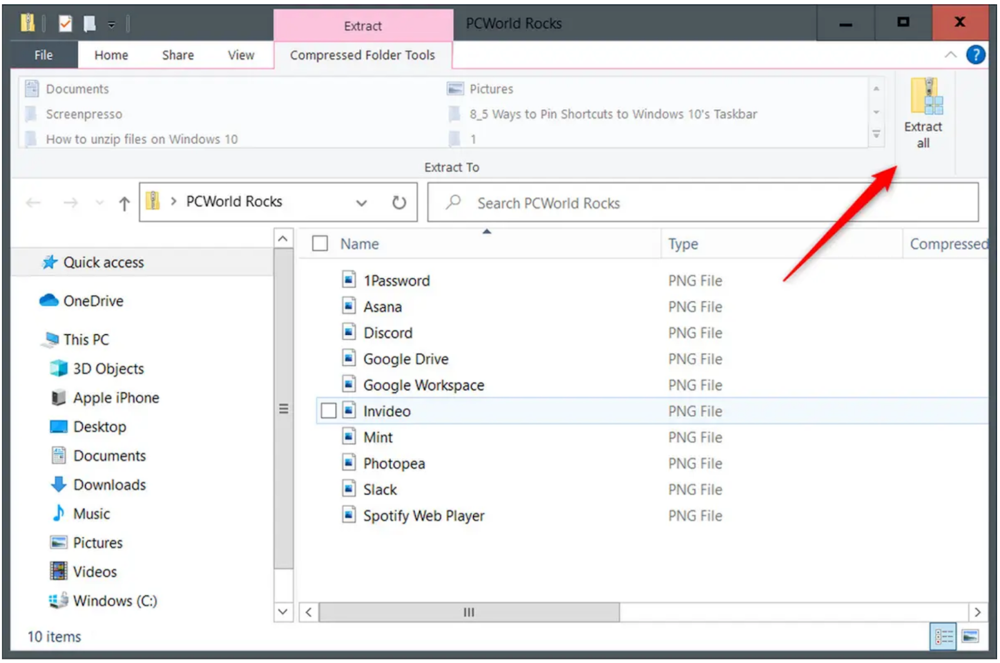
[Image: Marshall Gunnell/IDG](https://www.pcworld.com/article/394871/how-to-unzip-files-in-windows-10.html)

2. You’ll be prompted to select a destination for the extracted files. The file path to the current zip file location will be displayed. Click **“Browse”** if you want to change the destination for extracted files.

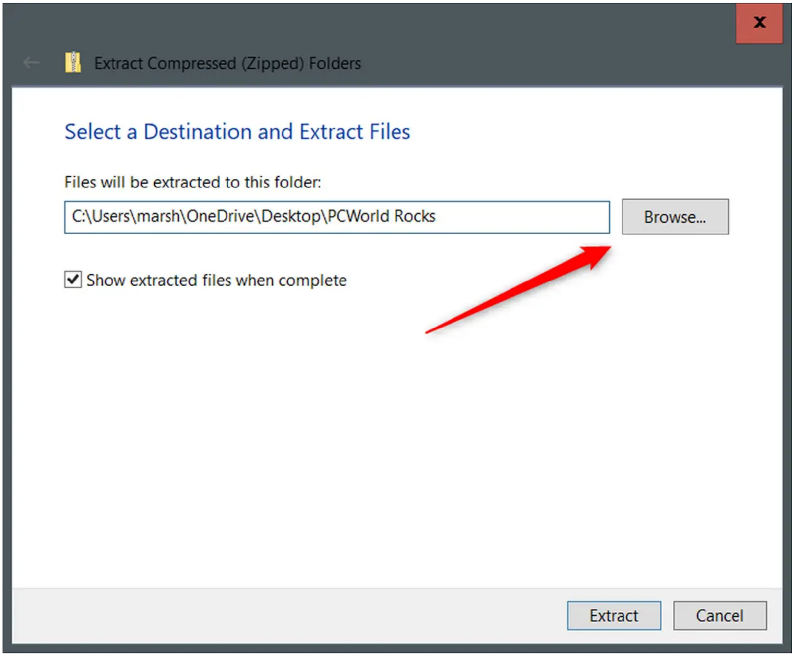
[Image: Marshall Gunnell/IDG](https://www.pcworld.com/article/394871/how-to-unzip-files-in-windows-10.html)

3. File explorer will open. Navigate to your chosen location and click **“Select Folder”**.

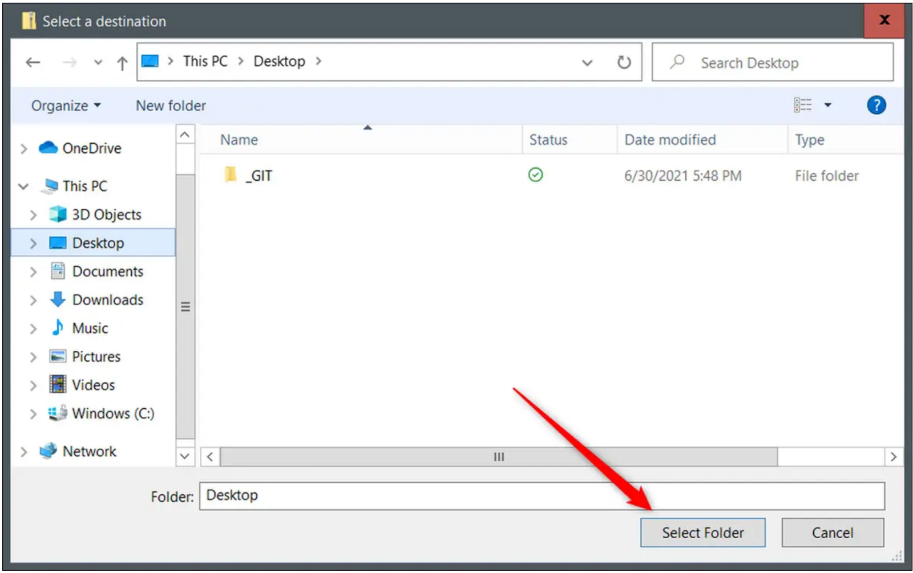
[Image: Marshall Gunnell/IDG](https://www.pcworld.com/article/394871/how-to-unzip-files-in-windows-10.html)

4. Another dialog box will appear. Click the **“Extract”** button.

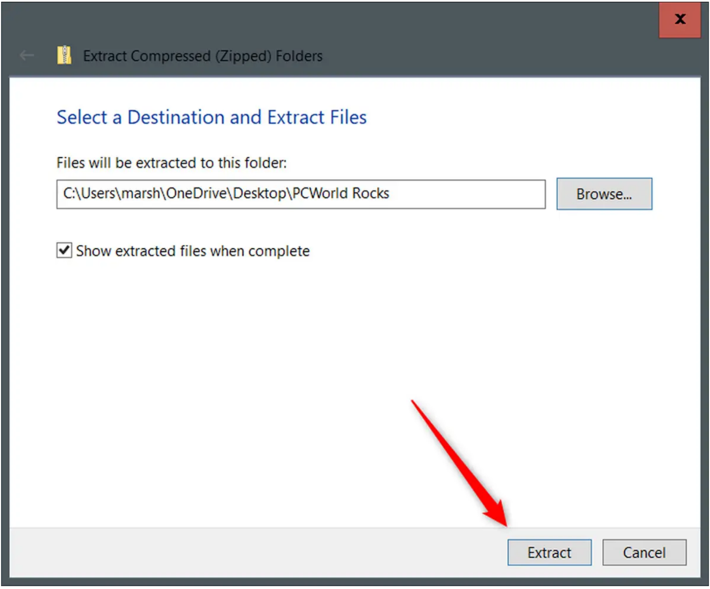
[Image: Marshall Gunnell/IDG](https://www.pcworld.com/article/394871/how-to-unzip-files-in-windows-10.html)

---
## Create Zip File on Windows
{:toc}

1. To create a ZIP file, highlight the files or folders you wish to compress, and **right-click**. Select **“Send To”** from the context menu.

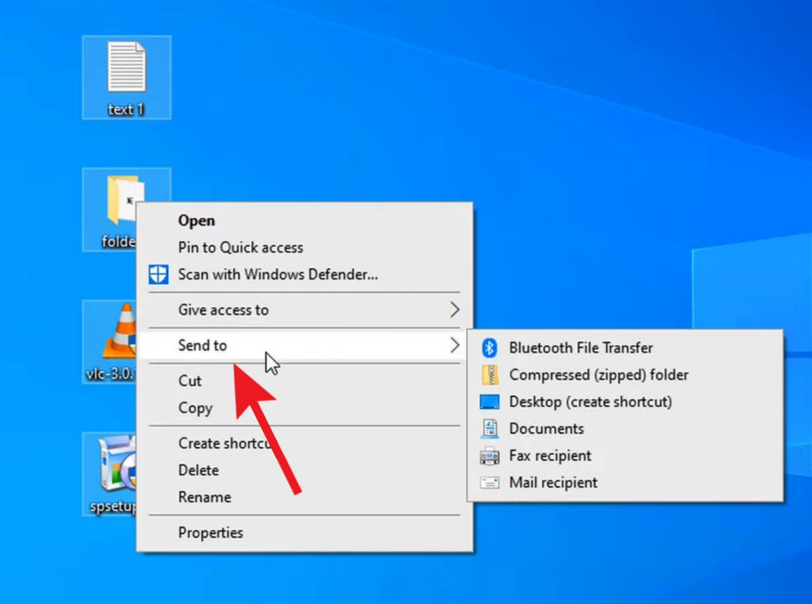
[Image: Marshall Gunnell/IDG](https://www.pcworld.com/article/394871/how-to-unzip-files-in-windows-10.html)

2. Select **“Compressed (zipped) folder”**.

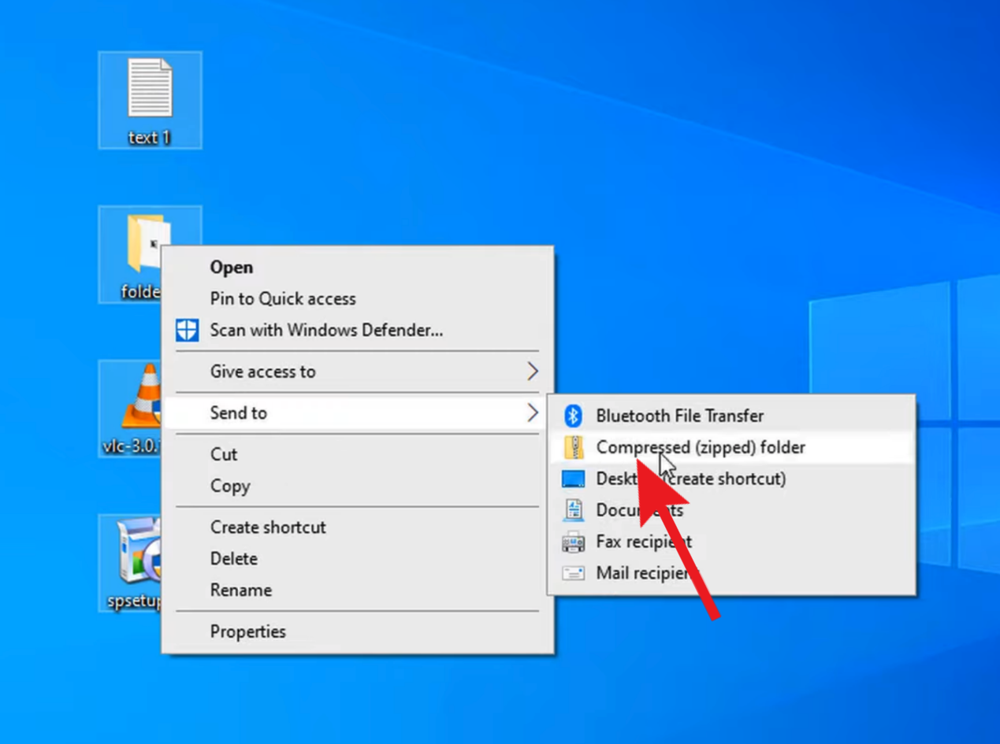
[Image: Marshall Gunnell/IDG](https://www.pcworld.com/article/394871/how-to-unzip-files-in-windows-10.html)

3. Depending on the size of the files, a progress bar may appear.

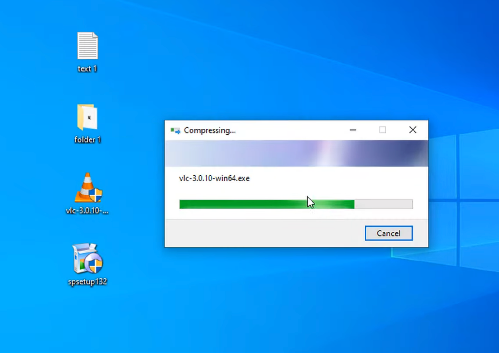
[Image: Marshall Gunnell/IDG](https://www.pcworld.com/article/394871/how-to-unzip-files-in-windows-10.html)

4. A new ZIP file/folder will be created and automatically added to the directory in which the original files reside.

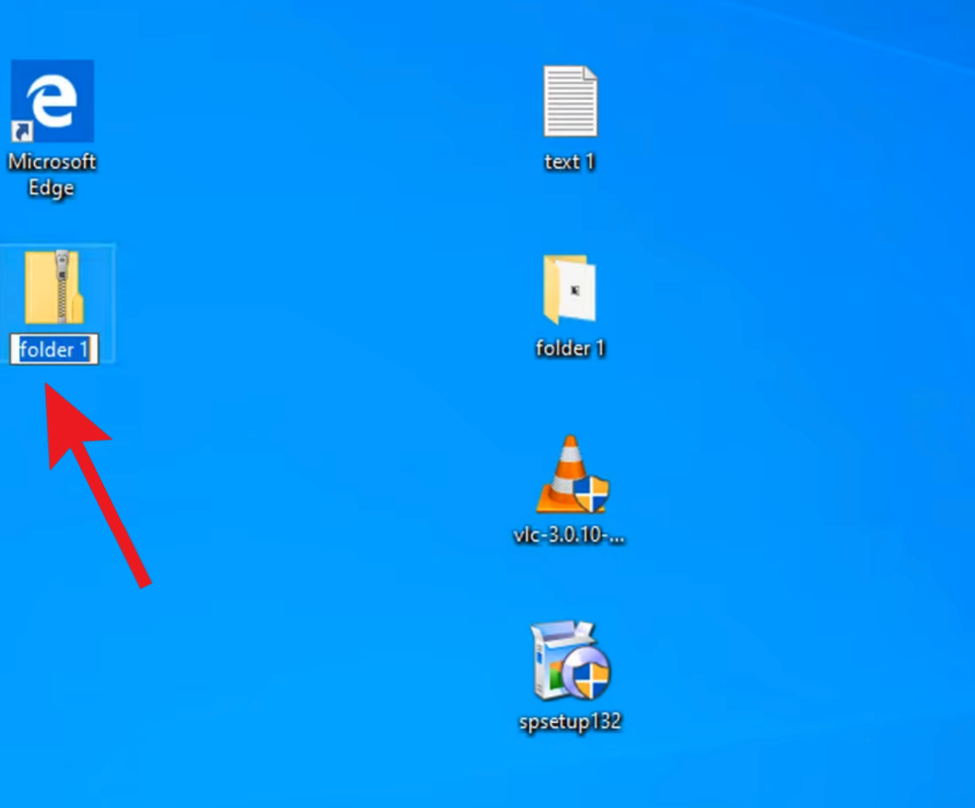
[Image: Marshall Gunnell/IDG](https://www.pcworld.com/article/394871/how-to-unzip-files-in-windows-10.html)

This tutorial was adapted from PC-World by John Slaff. The original article was authored by Marshall Gunnell and appeared on pcworld.com on July 20th, 2021. The original article can be found here: https://www.pcworld.com/article/394871/how-to-unzip-files-in-windows-10.html

---
## Unzipping files on Mac OS
{:toc}

1. **Double-click** the ZIP file, and the contents will be extracted to the ZIP files’ original location.

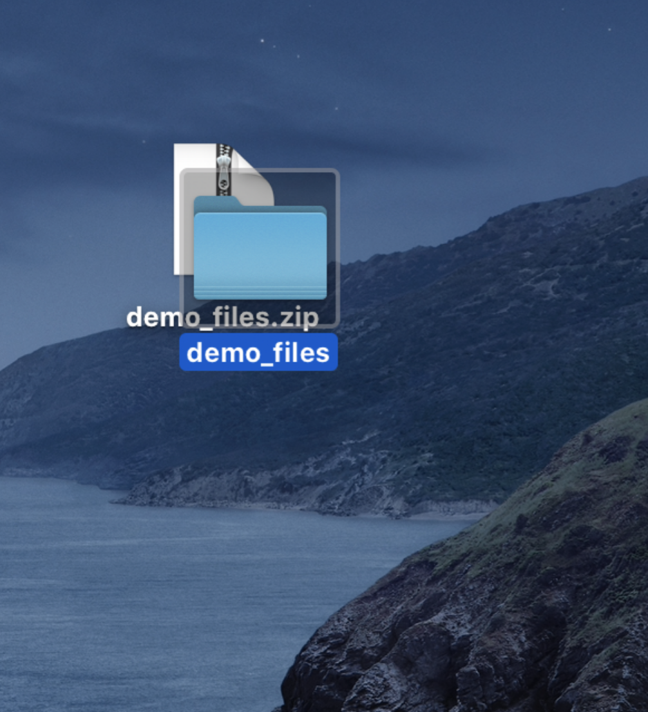

## Create Files on Mac OS
{:toc}

**Video**: [How to create a ZIP file on Mac OS](https://www.youtube.com/watch?v=q9Noa2cVtFA&t=57s)

To create a ZIP file, **right-click** a folder or file, and select **“Compress”**.

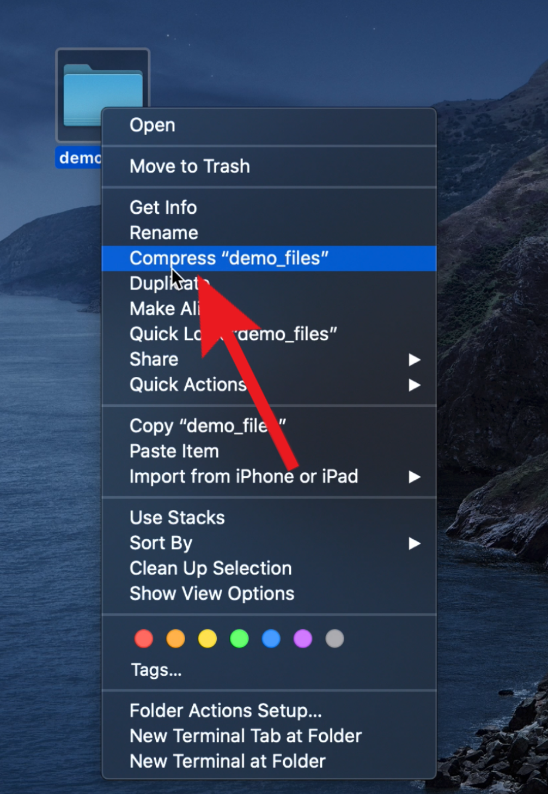

A new ZIP file will appear in the same location as the original file. Repeat the same process with multiple files and/or folders selected to add them to a new ZIP file.

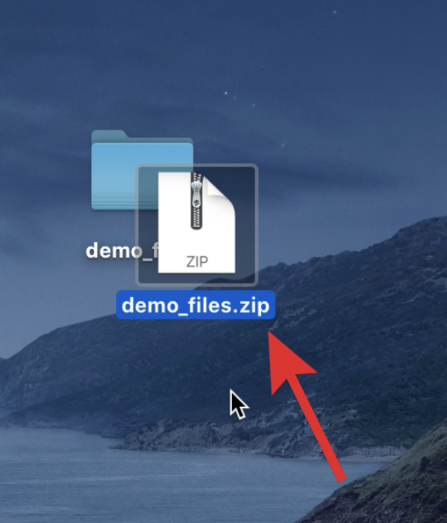

---
